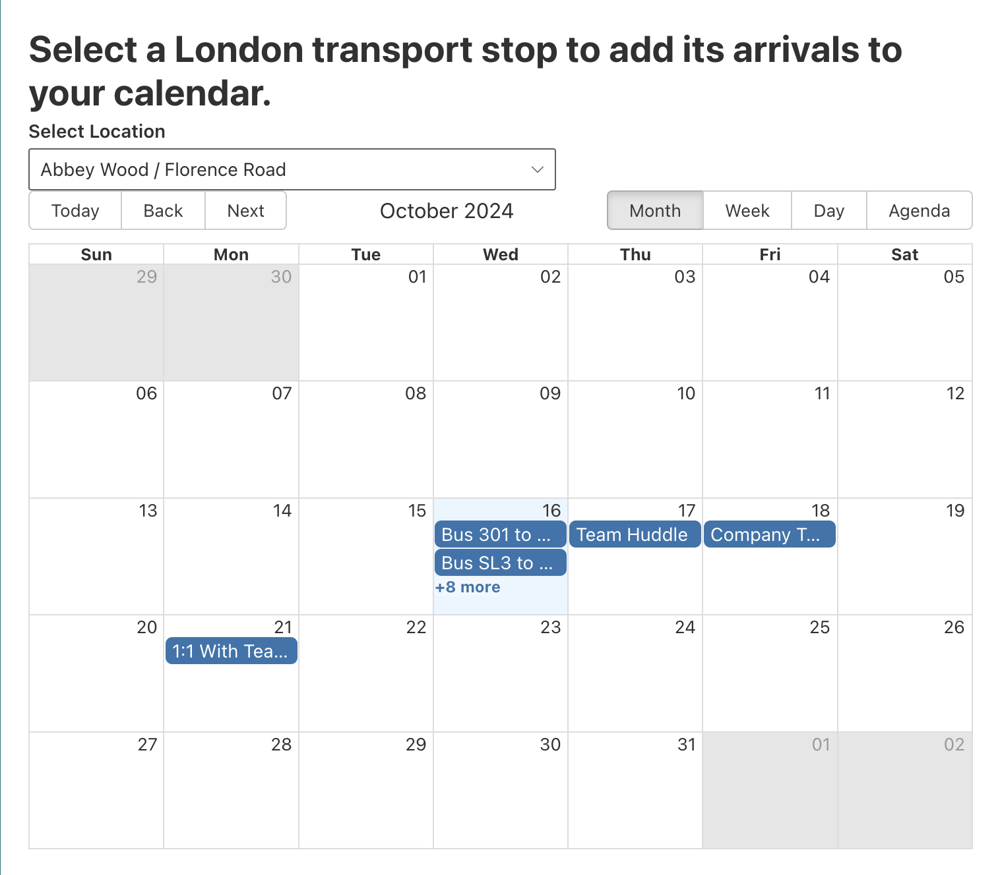

# TransitSquared

## Summary

This SPFx web part integrates Transport for London and Microsoft Graph APIs to display transport and calendar events using React and Fluent UI.


## Prerequisites

- Node.js
- SharePoint Online environment
- Azure AD app registration for Microsoft Graph API

## Version history

| Version | Date             | Comments        |
| ------- | ---------------- | --------------- |
| 1.1     | October 16, 2024 | Final release   |
| 1.0     | October 14, 2024 | Initial release |

---

## Minimal Path to Awesome

- Clone this repository
- Ensure that you are at the solution folder
- Run the following commands in the terminal:
  - **npm install**: Installs the necessary packages.
  - **gulp serve**: Serves the web part locally for development.

## Building and Bundling the Project

To generate the `.sppkg` file for deployment:

1. **Build the Solution:**
   - Open a terminal in the root of your SPFx project.
   - Run the following command to build the solution:
     ```bash
     gulp bundle --ship
     ```

2. **Package the Solution:**
   - After the build is complete, package the solution using:
     ```bash
     gulp package-solution --ship
     ```
   - This will generate a `.sppkg` file in the `sharepoint/solution` directory.

## Configuration

### SharePoint Admin Center

- Set up an App Catalog to deploy the `.sppkg` file.
- Ensure necessary permissions are granted for the web part.

### Azure Admin Center

- Register an Azure AD app for Microsoft Graph API access.
- Configure application permissions for Calendar.Read and other necessary scopes.
- Note the client ID and secret for use in the SPFx solution.
- If the webpart fails to fetch user information such as existing calendar events, you might need to generate a client secret for SharePoint Online Client Extensibility Web Application Principal under certificates & secrets

## Features

This web part allows users to:

- View personal calendar events from Microsoft Graph.
- Display transport arrivals from Transport for London.
- Select transport stops and integrate their schedules into a calendar view.

## How to Use

1. Add the web part to a SharePoint page.
2. Select a transport stop from the dropdown to view upcoming arrivals.
3. View both personal and transport events in the integrated calendar.

   

## References

- [Getting started with SharePoint Framework](https://docs.microsoft.com/en-us/sharepoint/dev/spfx/set-up-your-developer-tenant)
- [Building for Microsoft teams](https://docs.microsoft.com/en-us/sharepoint/dev/spfx/build-for-teams-overview)
- [Use Microsoft Graph in your solution](https://docs.microsoft.com/en-us/sharepoint/dev/spfx/web-parts/get-started/using-microsoft-graph-apis)
- [Publish SharePoint Framework applications to the Marketplace](https://docs.microsoft.com/en-us/sharepoint/dev/spfx/publish-to-marketplace-overview)
- [Microsoft 365 Patterns and Practices](https://aka.ms/m365pnp)